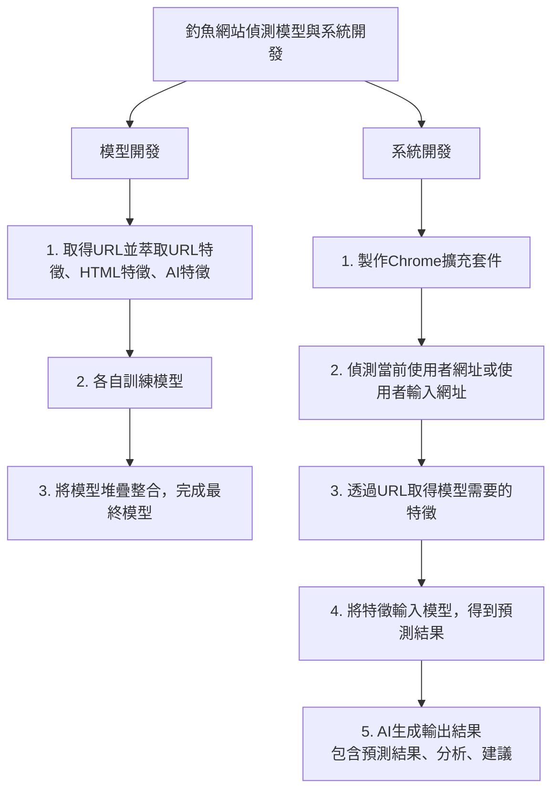

已經撰寫:
docs內的特徵與擴充套件相關

形式目前皆為hackmd
程式碼除非標註要在本地，否則運行環境為colab
  

```mermaid
graph TB
    A[釣魚網站偵測模型與系統開發] --> B[模型開發]
    A --> C[系統開發]

    %% 模型開發
    B --> B1[1. 取得URL並萃取URL特徵、HTML特徵、AI特徵]
    B1 --> B2[2. 各自訓練模型]
    B2 --> B3[3. 將模型堆疊整合，完成最終模型]

    %% 系統開發
    C --> C1[1. 製作Chrome擴充套件]
    C1 --> C2[2. 偵測當前使用者網址或使用者輸入網址]
    C2 --> C3[3. 透過URL取得模型需要的特徵]
    C3 --> C4[4. 將特徵輸入模型，得到預測結果]
    C4 --> C5[5. AI生成輸出結果<br>包含預測結果、分析、建議]
```

##  模型實作: 
  * MLP
  * XGBoost
  * RBF

